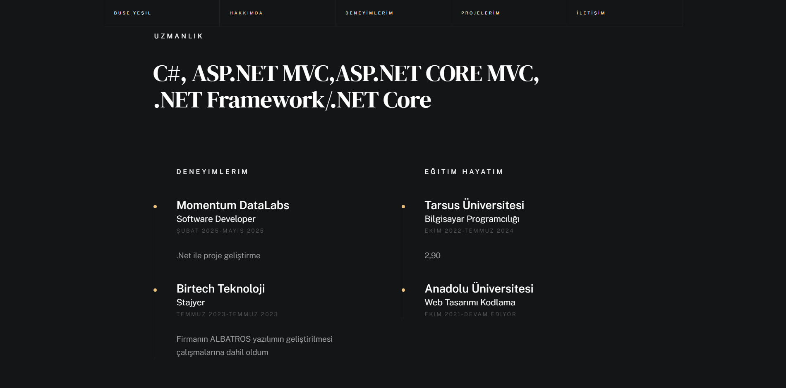
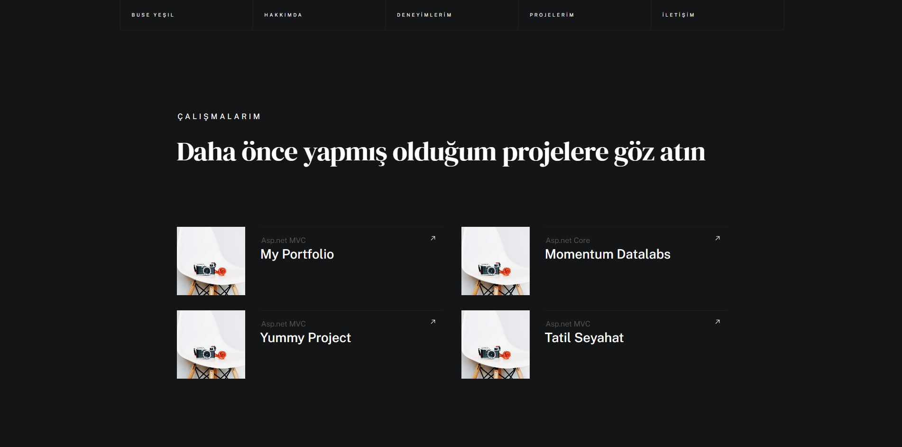

# 💼 MyPortfolio - Kişisel Portfolyo Web Sitesi

**ASP.NET MVC ile geliştirilmiş, profesyonel ve modern kişisel portfolyo yönetim sistemi. Yazılım geliştiriciler için kapsamlı CV sitesi ve admin paneli.**

---

## 📸 Proje Görselleri

### 🔐 Admin Giriş Paneli

### 📊 Admin Paneli 

### 🏠 Ana Sayfa - Banner Bölümü

### 👤 Hakkımda Bölümü

### 💼 Deneyimler ve Eğitim Hayatı

### 🚀 Projeler Galerisi

### 📧 İletişim Bölümü

---

## ✨ Özellikler

### 🌐 Kullanıcı Arayüzü (Portfolio Sitesi)

#### 🏠 Ana Sayfa
- **Dinamik Banner Sistemi**: 
  - Aktif/pasif durumlu banner'lar
  - Başlık ve açıklama yönetimi
  - Smooth scrolling ile sayfa geçişleri
- **Sosyal Medya Linkleri**: 
  - LinkedIn, GitHub, Instagram entegrasyonu
  - Dinamik sosyal medya butonları

#### 👨‍💻 Hakkımda Bölümü
- **Profil Bilgileri**:
  - Profil fotoğrafı görüntüleme
  - Kişisel tanıtım metni
  - CV indirme butonu (PDF/DOC)
- **Uzmanlık Alanları**:
  - C#, ASP.NET MVC, Entity Framework
  - HTML, CSS, JavaScript
  - SQL Server, Bootstrap
- **Deneyim Timeline**:
  - Şirket adı, pozisyon
  - Başlangıç-bitiş tarihleri
  - İş tanımı ve görevler
  - "Devam Ediyor" durumu
- **Eğitim Geçmişi**:
  - Okul adı, bölüm
  - Mezuniyet tarihleri
  - Derece bilgisi (Lisans, Yüksek Lisans)
  - Not ortalaması

#### 🚀 Projeler Bölümü
- **Proje Galerisi**:
  - Responsive grid yapı
  - Kategori bazlı filtreleme
  - Proje görselleri ve başlıkları
- **Detay Modal**:
  - Proje açıklaması
  - Kullanılan teknolojiler
  - GitHub linki
  - Proje kategorisi

#### 📧 İletişim Bölümü
- **İletişim Bilgileri**:
  - Email adresi (tıklanabilir mailto)
  - Telefon numarası (tıklanabilir tel)
- **Mesaj Formu**:
  - Ad Soyad, Email, Konu
  - Mesaj içeriği
  - Form validasyonu
  - Başarılı gönderim bildirimi

---

### 🔐 Admin Paneli

#### 👤 Giriş ve Güvenlik
- **Güvenli Authentication**:
  - Forms Authentication
  - Email ve şifre ile giriş
  - Session yönetimi (10 dakika timeout)
  - "Beni Hatırla" özelliği
  - Hatalı giriş bildirimleri

#### 🏢 Dashboard ve Navigasyon
- **Sidebar Menü**:
  - Siteye Git (Portfolio sayfası)
  - Profil Bilgileri
  - Kategoriler
  - Projelerim
  - Hakkımda
  - Banner Yönetimi
  - İletişim
  - Eğitim
  - Deneyim
  - Uzmanlık Alanı
  - Gelen Mesajlar
  - Sosyal Medya
- **Navbar**:
  - Profil fotoğrafı
  - Admin adı soyadı
  - Mesaj bildirimleri (son 3)
  - Çıkış yapma

#### 📝 İçerik Yönetimi

**Banner Yönetimi**
- Yeni banner ekleme
- Başlık ve açıklama düzenleme
- Aktif/Pasif durumu
- Silme işlemi

**Kategori Yönetimi**
- Kategori ekleme (Web, Mobil, Desktop vb.)
- Kategori düzenleme
- Kategori silme
- Kategori listesi

**Proje Yönetimi**
- Yeni proje ekleme
- Proje bilgileri:
  - Proje adı
  - Kategori seçimi (dropdown)
  - Proje görseli URL
  - Açıklama
  - GitHub URL
- Proje düzenleme
- Proje silme
- Proje listesi

**Deneyim Yönetimi**
- İş deneyimi ekleme:
  - Şirket adı
  - Pozisyon
  - Başlangıç tarihi
  - Bitiş tarihi (opsiyonel)
  - Açıklama
- Deneyim düzenleme
- Deneyim silme
- Tarihsel sıralama

**Eğitim Yönetimi**
- Eğitim bilgisi ekleme:
  - Okul adı
  - Bölüm
  - Başlangıç-bitiş tarihi
  - Derece (Önlisans/Lisans/Yüksek Lisans)
  - Açıklama
- Eğitim düzenleme
- Eğitim silme

**Uzmanlık Alanı Yönetimi**
- Yeni alan ekleme (C#, JavaScript vb.)
- Alan düzenleme
- Alan silme

**Hakkımda Yönetimi**
- Başlık güncelleme
- Açıklama metni düzenleme
- Profil fotoğrafı yükleme
- CV dosyası yükleme (PDF/DOC/DOCX)
- Mevcut CV görüntüleme

**İletişim Bilgileri**
- Telefon numarası güncelleme
- Email adresi güncelleme

**Sosyal Medya Yönetimi**
- Platform ekleme (LinkedIn, GitHub, Instagram vb.)
- URL güncelleme
- Platform silme

#### 💬 Mesaj Yönetimi
- **Gelen Mesajlar**:
  - Okunmamış mesajlar listesi
  - Mesaj detayı görüntüleme
  - Gönderen bilgileri (Ad, Email, Konu)
  - Mesaj içeriği
  - Okundu olarak işaretleme
  - Mesaj silme
- **Okunan Mesajlar**:
  - Okunmuş mesajlar listesi
  - Ayrı sayfa görünümü
- **Bildirimler**:
  - Navbar'da son 3 mesaj
  - Okunmamış mesaj sayısı

#### 👤 Profil Yönetimi
- **Profil Güncelleme**:
  - Ad ve Soyad
  - Email adresi
  - Profil fotoğrafı yükleme
  - Şifre ile onaylama
  - Güncelleme sonrası session yenileme

---

## 🎨 Tasarım Özellikleri

### Kullanıcı Arayüzü (Luther Template)
- ✅ **Modern ve Minimal**: Siyah-beyaz tema, altın vurgular
- ✅ **Smooth Animations**: Scroll animasyonları
- ✅ **Responsive Design**: Mobil, tablet, desktop uyumlu
- ✅ **Interactive Elements**: Hover efektleri, modal'lar
- ✅ **Clean Typography**: Okunabilir font seçimi

### Admin Paneli (DarkPan Template)
- ✅ **Dark Theme**: Göz yormayan koyu tema
- ✅ **Sidebar Navigation**: Kolay erişilebilir menü
- ✅ **Responsive Tables**: Mobil uyumlu tablolar
- ✅ **Form Validations**: Kullanıcı dostu form kontrolleri
- ✅ **Bootstrap 5**: Modern UI bileşenleri

---

## 🛠️ Kullanılan Teknolojiler

### Backend
- **ASP.NET MVC 5** - Web framework ve MVC pattern
- **Entity Framework 6** - ORM (Database First yaklaşımı)
- **C# .NET Framework 4.7.2** - Programlama dili
- **LINQ** - Veri sorgulama dili
- **SQL Server** - İlişkisel veritabanı

### Frontend
- **HTML5 & CSS3** - Semantik yapı ve modern stil
- **JavaScript & jQuery 3.7.1** - İnteraktivite
- **Bootstrap 5.3.3** - Responsive grid ve bileşenler
- **Font Awesome 5.10.0** - İkonlar
- **Luther Template** - Kullanıcı arayüzü şablonu
- **DarkPan Template** - Admin paneli şablonu

### Güvenlik ve Authentication
- **Forms Authentication** - Kullanıcı kimlik doğrulama
- **Session Management** - Oturum yönetimi
- **Authorize Attribute** - Controller seviyesi yetkilendirme
- **Global Filters** - Uygulama geneli güvenlik
- **ModelState Validation** - Form doğrulama

### Diğer Teknolojiler
- **File Upload** - HttpPostedFileBase ile dosya yükleme
- **Partial Views** - Modüler view yapısı
- **ViewBag & ViewData** - View'a veri aktarımı
- **TempData** - Sayfalar arası veri taşıma
- **Razor Syntax** - Template engine

---

## 📞 İletişim 

### 👨‍💻 Proje Sahibi: Buse Yeşil

- 📧 **Email:** buseyesil55@gmail.com
- 💼 **LinkedIn:** [linkedin.com/in/buse-yesil](https://www.linkedin.com/in/buse-y-5b3073249/)

### 📦 Kullanılan Şablonlar
- **[DarkPan](https://themewagon.com/themes/darkpan/)** by HTML Codex - Admin Panel Template
- **[Luther](https://www.styleshout.com/)** by StyleShout - Portfolio Template

### 🛠️ Teknoloji ve Kütüphaneler
- **[ASP.NET MVC](https://dotnet.microsoft.com/apps/aspnet/mvc)** by Microsoft
- **[Entity Framework](https://docs.microsoft.com/ef/)** by Microsoft
- **[Bootstrap](https://getbootstrap.com/)** by Twitter
- **[jQuery](https://jquery.com/)** by JS Foundation
- **[Font Awesome](https://fontawesome.com/)** by Fonticons
- **[Google Fonts](https://fonts.google.com/)** by Google

---

## 📌 Son Notlar

### ✅ Projenin Güçlü Yönleri
- ✅ Temiz ve modüler kod yapısı
- ✅ Responsive ve modern tasarım
- ✅ Kolay kurulum ve kullanım
- ✅ Kapsamlı admin paneli
- ✅ Dosya yükleme desteği

### ⚠️ Geliştirmeye Açık Alanlar
- ⚠️ Şifre hashleme eksikliği
- ⚠️ Unit test yokluğu
- ⚠️ API endpoint'leri yok
- ⚠️ Logging mekanizması yok
- ⚠️ Email servisi entegrasyonu yok

### 🎓 Öğrenme Çıkarımları
Bu proje ile:
- ASP.NET MVC pattern'ini öğrendim
- Entity Framework Database First yaklaşımını uyguladım
- Forms Authentication ve Session yönetimini kavradım
- CRUD işlemlerini gerçekleştirdim
- Dosya yükleme işlemlerini hallettim
- Partial View ve Layout kullanımını öğrendim

---

## 🎉 Sonuç

**MyPortfolio**, modern web geliştirme teknikleriyle oluşturulmuş, kullanıcı dostu ve yönetilebilir bir kişisel portfolyo web sitesidir. Yazılım geliştiricilerin kendilerini profesyonel bir şekilde tanıtmaları için ideal bir platformdur.

---

🚀 **Mutlu kodlamalar!**

---
